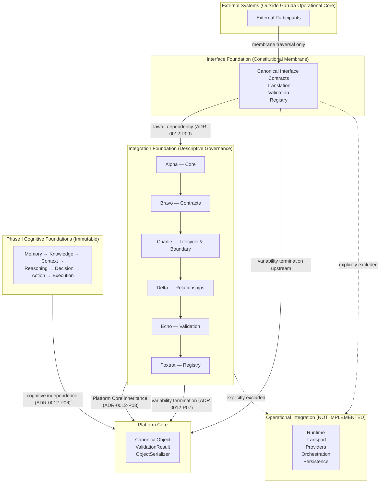

# Integration Foundation — Architecture Diagram

## Purpose

Consolidated architecture diagram for the Integration Foundation after GAR-SPRINT-0011 Missions
Alpha through Foxtrot. This document describes descriptive architectural relationships only.
Operational integration behavior remains outside the Integration Foundation.

## Authority

- [GAR-0018](../../GAR-0018.md)
- [ADR-0012](../adr/ADR-0012-integration-foundation.md)
- [GAR-SPRINT-0011](../sprints/GAR-SPRINT-0011-integration-foundation.md)

## Layered Architecture

## Module Responsibilities

| Module | Mission | Responsibility |
| --- | --- | --- |
| Core | Alpha | Foundation substrate and Interface dependency wiring |
| Contracts | Bravo | Integration contracts subordinate to interface contracts |
| Lifecycle & Boundary | Charlie | Artifact lifecycle and membrane boundary metadata |
| Relationships | Delta | Descriptive participant relationship semantics |
| Validation | Echo | Deterministic integration artifact validation |
| Registry | Foxtrot | Process-local descriptive participant catalog |

## Architectural Boundaries

### Descriptive Before Operational

All Integration Foundation modules govern architectural **description** only. They do not perform
operational integration execution, connectivity, message delivery, or provider invocation.

### Variability Termination

External variability terminates at the Interface Foundation and Integration Foundation. No
integration variability propagates into Phase I cognitive foundations.

### Registry and Validation Scope

- **Validation** verifies canonical integration artifacts before membrane-adjacent use.
- **Registry** catalogs descriptive participant metadata — it does not instantiate or execute.

### Operational Exclusion

The dashed boundary to Operational Integration indicates capabilities explicitly excluded from
GAR-SPRINT-0011 and requiring future constitutional authority.

## Related Documents

- [Integration Foundation Overview](overview.md)
- [Integration Contracts](integration-contracts.md)
- [Integration Lifecycle and Boundary Model](integration-lifecycle-boundary-model.md)
- [Integration Relationship Framework](integration-relationship-framework.md)
- [Integration Validation Framework](integration-validation-framework.md)
- [Integration Registry](integration-registry.md)
