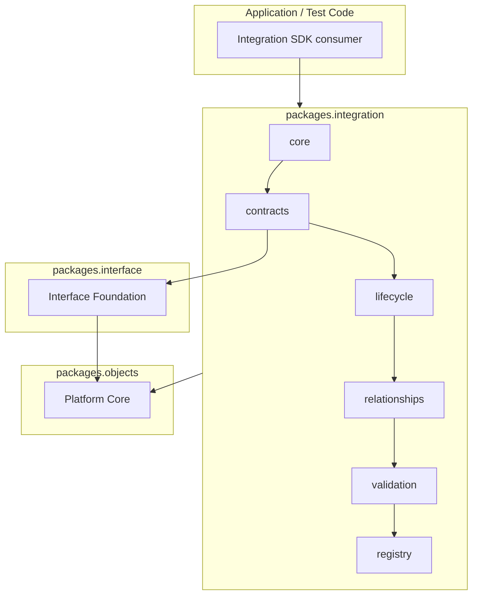

# Integration Foundation SDK Architecture Guide

## Documentation Provenance

| Field | Value |
| --- | --- |
| Governing Constitution | [GAR-0018](../../../GAR-0018.md) |
| Governing ADR | [ADR-0012](../../adr/ADR-0012-integration-foundation.md) |
| Governing Sprint | [GAR-SPRINT-0011](../../sprints/GAR-SPRINT-0011-integration-foundation.md) |
| Repository baseline | `121365c` |

## ADR-0012 Principles For SDK Consumers

| Principle | SDK implication |
| --- | --- |
| P01 — Membrane Traversal | Consume Interface contracts before integration contracts |
| P02 — Subordination | Use `build_interface_subordination()` for lawful contract links |
| P03 — Descriptive Model | Treat all Integration artifacts as metadata, not executors |
| P04 — Technology Neutrality | Avoid provider/protocol-specific identifiers in metadata |
| P05 — Participant Classification | Use relationship and registry taxonomy structures only |
| P06 — Cognitive Independence | Do not embed Phase I objects in Integration artifacts |
| P07 — Variability Termination | Validate artifacts with `evaluate_integration_artifact()` |
| P08 — Platform Core Inheritance | Use `validate()` and Platform Core serialization |
| P09 — Interface Dependency | Depend on Interface Foundation without modifying it |

## Package Dependency Diagram

Operational integration, transport, providers, persistence, and orchestration are outside this diagram
by constitutional design.

## Canonical Artifact Types

Validation and registry composition recognize these published artifact types via
`CANONICAL_INTEGRATION_ARTIFACT_TYPES`:

- `IntegrationFoundation`
- `CanonicalIntegrationContract`
- `IntegrationBoundaryModel`
- `IntegrationArtifactLifecycle`
- `CanonicalIntegrationRelationship`

## Related Documents

- [Integration Foundation Architecture Diagram](../../architecture/integration/integration-foundation-architecture-diagram.md)
- [Architecture documentation index](../../architecture/integration/README.md)
