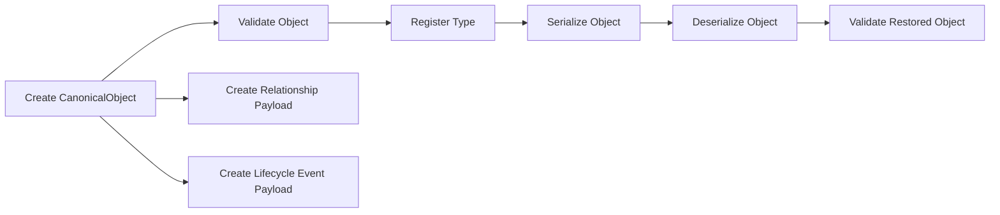

# Platform Core SDK Architecture Guide

## Purpose

The Platform Core SDK provides the neutral object substrate for GAR-SPRINT-0002. Its job is to make
Universal Objects identifiable, registerable, serializable, relatable, lifecycle-aware, and
validatable without introducing domain or service behavior.

## Package Boundary

The SDK lives under `packages/objects`. It is not owned by backend, frontend, infrastructure, or
application-specific services.

## Module Responsibilities

### Universal Object Framework

Owns the base object identity and structure:

- UUID identity
- object type
- schema version
- object version
- metadata
- tags
- lifecycle state
- audit fields
- validation hooks
- behavior registration
- relationship storage placeholder

### Universal Object Registry

Owns canonical type registration:

- register canonical object classes
- reject non-canonical classes
- reject duplicates
- look up and enumerate registered types

### Serialization Framework

Owns deterministic object state payloads:

- serialize object state to dictionaries
- serialize object state to JSON
- deserialize dictionaries or JSON back to `GarudaObject`

### Universal Relationship Framework

Owns relationship payloads between object IDs:

- source object ID
- target object ID
- relationship type
- direction
- status
- metadata
- audit fields

Relationships do not embed objects and do not perform persistence.

### Lifecycle Event Framework

Owns lifecycle event payloads:

- event ID
- related object ID
- event type
- timestamp
- actor
- metadata
- event version

Lifecycle events are payload models. They do not publish to an event bus or process workflows.

### Validation Framework

Owns platform-level validation:

- validation result aggregation
- validation error modeling
- severity levels
- categories
- helper validation functions
- object validation hook integration

## Cross-Module Flow

## Extension Points

Supported extension points are intentionally small:

- subclass `CanonicalObject`
- register canonical object classes in `ObjectRegistry`
- register object validation hooks
- register inert behavior values on objects
- compose relationship and lifecycle event payloads

## Explicit Non-Goals

The Platform Core SDK does not implement:

- new domain object models
- business-rule engines
- persistence
- database schemas
- REST endpoints
- frontend validation
- event bus publishing
- workflow execution
- AI reasoning
- Knowledge Graph behavior
- Memory behavior
- trading systems
- portfolio systems

## Future Compatibility

Future platform layers should build on these contracts rather than changing them casually. When a
future sprint needs additional behavior, it should add that behavior in an approved scope while
keeping Platform Core service-independent and domain-neutral.
