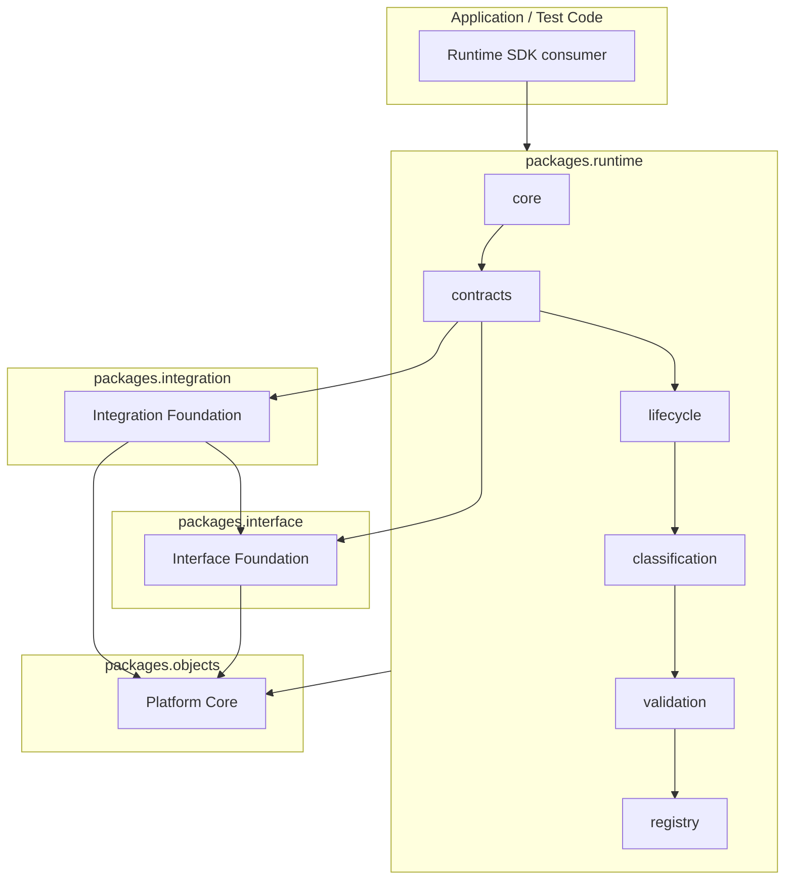

# Runtime Foundation SDK Architecture Guide

## Documentation Provenance

| Field | Value |
| --- | --- |
| Governing Constitution | [GAR-0019](../../../GAR-0019.md) |
| Governing ADR | [ADR-0013](../../adr/ADR-0013-runtime-foundation.md) |
| Governing Sprint | [GAR-SPRINT-0012](../../sprints/GAR-SPRINT-0012-runtime-foundation.md) |
| Repository baseline | `c0e6433` |

## ADR-0013 Principles For SDK Consumers

| Principle | SDK implication |
| --- | --- |
| P01 — Stack Traversal | Consume Interface and Integration contracts before runtime contracts |
| P02 — Subordination | Use `build_integration_subordination()` and `build_interface_subordination()` |
| P03 — Descriptive Model | Treat all Runtime artifacts as metadata, not executors |
| P04 — Technology Neutrality | Avoid provider/protocol-specific identifiers in metadata |
| P06 — Cognitive Independence | Do not embed Phase I objects in Runtime artifacts |
| P07 — Variability Termination | Validate artifacts with `evaluate_runtime_artifact()` |
| P08 — Platform Core Inheritance | Use `validate()` and Platform Core serialization |
| P09 — Integration Dependency | Depend on Integration Foundation without modifying it |
| P10 — Interface Dependency | Depend on Interface Foundation without modifying it |
| P11 — Universal Execution Separation | Do not conflate Runtime with `UniversalExecution` |
| P12 — Operational Runtime Exclusion | Do not introduce operational runtime semantics |

## Package Dependency Diagram

Operational runtime, transport, providers, persistence, orchestration, and execution engines are
outside this diagram by constitutional design.

## Canonical Artifact Types

Validation and registry composition recognize these published artifact types via
`CANONICAL_RUNTIME_ARTIFACT_TYPES`:

- `RuntimeFoundation`
- `CanonicalRuntimeContract`
- `RuntimeBoundaryModel`
- `RuntimeArtifactLifecycle`
- `CanonicalRuntimeContextClassification`

## Related Documents

- [Runtime Foundation Architecture Overview](../../architecture/runtime/overview.md)
- [Architecture documentation index](../../architecture/runtime/README.md)
- [Tripartite Distinction Guide](tripartite-distinction-guide.md)
